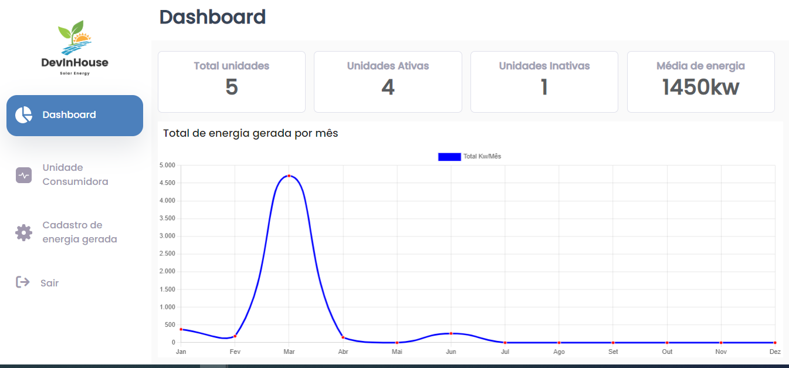

# SolaryEnergia
## Refatoraçao do projeto que foi desenvolivido para o curso Devinhouse NDD - em 2022.
## FrontEnd





<div>
<h2>Tecnologias Usadas</h2>
<div style="display: inline_block"><br>
  
  
  
   
  
</div>
  
  <h2>Requisitos da Aplicação</h2>
  <ul>
    <li>Uma Tela de Login contendo um formulário com campos de email e senha. Os campos de email e senha são obrigatórios. Ao clicar no botão de Entrar e passar pela validação, redirecionar para tela de Dashboard.</li>
    <li>Menu lateral, contendo as opções Dashboard, Unidade Consumidora e Cadastro de energia gerada. O menu deve ser configurado usando Angular Router. </li>
    <li>Uma tela de Dashboard contendo 4 cards: Total de unidades, unidades ativas, unidades inativas e média de energia.</li>
    <li>A tela  de Dashboard deve conter um gráfico de linha exibindo os meses do ano. O gráfico deverá exibir o total de energia gerado por mês, sendo assim deve-se realizar a soma por mês do total gerado de todas as unidades e exibir no gráfico o total de cada mês, o eixo x deve-se exibir os últimos 12 meses e no eixo y o total por mês.</li>
    <li>Uma tela de Listagem de unidades (consumir rota /unidades do json-server) contendo uma tabela com as colunas ID, apelido, Local, Marca e modelo, além dos botões Editar e Excluir. A tela deve conter um botão Nova unidade (Ao clicar, enviar usuário para tela de cadastro de unidade).</li>
    <li>Uma tela de cadastro de unidade, contendo um formulário com os campos apelido, Local, Marca, modelo e status (Checkbox). Ao clicar no botão salvar, cadastrar unidade via POST na rota /unidades do json-server. Todos os campos do formulário são obrigatórios.</li>
    <li>Implementar botão de remover unidade na tela de Listagem de unidades. Ao clicar no botão deve remover unidade clicada via DELETE na rota /unidades/:id do json-server.</li>
    <li>Criar o botão de editar unidade, ao clicar no botão de editar, enviar usuário para tela de edição de unidade. Ao renderizar a tela, trazer os campos preenchidos com as informações da unidade clicada, ao clicar em salvar, salvar os valores via PUT na rota /unidades/:id do json-server.</li>
    <li>ICriar a tela de Lançamento de geração mensal contendo um formulário com um 'Select' (listando como opção as unidades já cadastradas e ativas, consumindo do json-serve), um campo de data e um campo de total kw gerado (aceita somente números). Ao clicar em salvar, cadastre valores via POST na rota /gerações do json-server.</li>
</ul>
  
  
  ## Para executar o projeto você deve:
  
  ``` bash
# Clone este repositório :
  $ git@github.com:Elianehenri/solaryEnergiaFront.git
  ```
  
  ### instalar:
  ``` bash

$ npm install
  
  ```
  ### Abrir 2 terminais , no primeiro "Para executar o Json":
  
 ``` bash
$ npm rum api 
  ### ou
$ json-server db.json --watch
  ```
  ### no  segunto terminal "Para executar o angular digite o comando:"
   ``` bash
$ npm start
  ```
  
  

 
  
This project was generated with [Angular CLI](https://github.com/angular/angular-cli) version 15.1.2.

## Development server

Run `ng serve` for a dev server. Navigate to `http://localhost:4200/`. The application will automatically reload if you change any of the source files.

## Code scaffolding

Run `ng generate component component-name` to generate a new component. You can also use `ng generate directive|pipe|service|class|guard|interface|enum|module`.

## Build

Run `ng build` to build the project. The build artifacts will be stored in the `dist/` directory.

## Running unit tests

Run `ng test` to execute the unit tests via [Karma](https://karma-runner.github.io).

## Running end-to-end tests

Run `ng e2e` to execute the end-to-end tests via a platform of your choice. To use this command, you need to first add a package that implements end-to-end testing capabilities.

## Further help

To get more help on the Angular CLI use `ng help` or go check out the [Angular CLI Overview and Command Reference](https://angular.io/cli) page.
